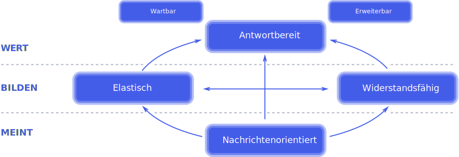

# Das Reaktive Manifest
Beschrieben unter: https://www.reactivemanifesto.org/de 

Reaktive Systeme sind:
* Responsive
* Resilient
* Elastic
* Message Driven

Die Bedeutungen sind auf der Seite beschrieben.
Nicht-reaktive Beispiele hierzu:
* Responsive: Tomcat Jetty hat eine fixe Anzahl an Threads. Bei jeder Anfrage wird ein Thread genutzt. Sind zu viele parallele Anfragen und somit Threads aktiv, und kein weiterer mehr verfügbar, gibt der Server einen Response 500 - Server Error.
* Resilient: Eine Aktion geht über mehrere Services, die untereinander mit synchronen RPCs erbeiten. Ein System restartet, die Antwort bleibt ein Fehler. Die ganze Aktion ist fehlgeschlagen.
* Elastic: Unter Last schwanken die Antwortzeiten. Es wird nicht anhand vom Ressourcenverbrauch bemerkt. Antwortzeiten sind unregelmässig zwischendurch gut und der Auto-Scaler kann nicht eindeutig bestimmen, ob weitere Ressourcen benötigt werden.
* Message Driven: Threads blockieren, während sie auf RPC/IO Antworten warten.

## Analogien
Man kann lokal einen reaktiven Service bauen. RxJava, Reactor (Spring-Webflux), Vertx, Mutiny etc. sind Java Libraries die Java Implementierungen hierfür an.
Ab Java 9 erhielt auch eine Implementierung (Flow) Einzug in die Concurrent Library und somit in die Base JVM.

Ein System muss nicht auf einen Service beschränkt sein. Kommunikation zwischen mehreren Servern kann auch über Nachrichten geschehen, wie z.B. über Message Broker oder Protokolle die nicht nur 1:1 sondern auch 1:Many Verbindungen zulassen.

| Reactor             | Kafka              |
|---------------------|--------------------|
| Publisher           | Producer           |
| Subscriber          | Consumer           |
| Hot Stream          | Topic              |
| Cold Stream         | -                  |
| Mono (0-1 Messages) | Record             |
| Flux (0-n Messages) | n Records          |
| Processor | Topic |
